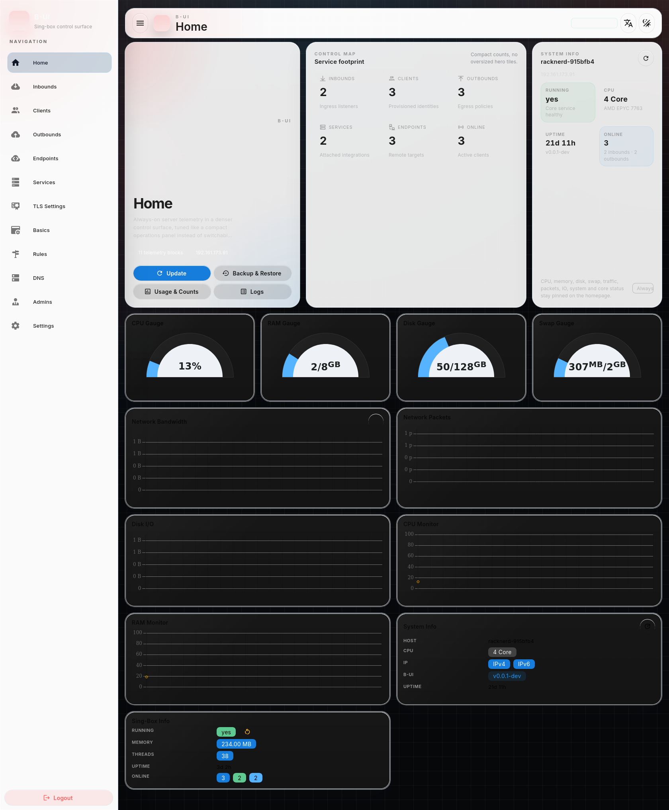

# B-UI

基于 [S-UI](https://github.com/alireza0/s-ui) 的定制化 fork，保留 Go 后端能力，并将前端界面按本仓库的设计基线持续重做。

当前仓库的重点不再是“同步上游说明文档”，而是明确下面三件事：

- 这是一个 fork，核心能力来源于上游 `S-UI`
- 前端代码直接位于当前仓库的 `frontend/` 目录，不再需要单独的子模块提交
- 所有新的 UI 改动默认遵循 [DESIGN.md](./DESIGN.md)

当前首页已经切到更明确的控制台布局：

- 顶部首页信息卡片优先保证在桌面端一屏完整显示
- 监控统计卡、运行态卡与首页介绍卡按三栏对齐
- 首页固定展示全部遥测统计，不再提供可选 live tiles 开关
- 移动端保持纵向堆叠，并避免横向溢出

## 首页运行截图

下图为本地构建产物在浏览器中的首页运行效果，当前布局固定展示 CPU、RAM、Disk、Swap、网络、包速率、磁盘 IO、系统信息与 Sing-box 运行态，避免出现高瘦卡片和内容裁切。



**想参与开发？** 见 [CONTRIBUTING.md](./CONTRIBUTING.md)。

## 仓库结构

- `frontend/`: Vue 3 + Vuetify 4 前端源码目录，直接由当前仓库跟踪
- `web/`: 编译后的前端静态资源会被打包到这里
- `api/`, `service/`, `database/`, `middleware/`: Go 后端主体
- `DESIGN.md`: 当前 UI 设计参考，现阶段采用 Raycast 风格的深色工具界面

## 初始化

```sh
git clone https://github.com/BeanYa/b-ui.git
cd b-ui
```

说明：

- `frontend/` 已经和后端源码合并在同一个仓库里
- 前端修改不再需要单独维护或确认额外的子模块 commit
- CI 会直接使用当前仓库里的 `frontend/` 内容构建

## 从已安装的上游版本迁移

对于已经安装了上游版本的 Linux 服务器，本仓库现在支持原地迁移，并在迁移完成后自动确认更新到最新的 `b-ui` release。

迁移时会继续复用原有：

- `/usr/local/s-ui` 安装目录
- 原有 `s-ui.db` 数据内容
- 现有配置与数据

迁移后的目标数据库路径为 `/usr/local/s-ui/db/b-ui.db`。如果检测到旧的 `/usr/local/s-ui/db/s-ui.db` 且新库不存在，程序会在首次迁移/启动时自动把旧库内容迁移到 `b-ui.db`，避免端口、入站、出站和面板配置被初始化成空数据。

推荐直接执行：

```sh
bash <(curl -Ls https://raw.githubusercontent.com/BeanYa/b-ui/main/migrate-to-b-ui.sh)
```

如果要迁移到指定版本：

```sh
bash <(curl -Ls https://raw.githubusercontent.com/BeanYa/b-ui/main/migrate-to-b-ui.sh) v0.0.1
```

如果你想直接调用安装脚本，也可以显式使用迁移模式：

```sh
bash <(curl -Ls https://raw.githubusercontent.com/BeanYa/b-ui/main/install.sh) --migrate
```

迁移脚本会自动完成以下操作：

1. 检测现有旧版安装
2. 停止旧服务
3. 在 `/var/backups/s-ui/<timestamp>/` 创建回滚备份
4. 下载本仓库 release 并原地覆盖安装
5. 执行 `sui migrate`
   如果只有旧的 `s-ui.db`，会先自动迁移为 `b-ui.db`
6. 把 systemd 服务名从 `s-ui` 切换为 `b-ui`
7. 把管理命令切换为 `b-ui`
8. 未指定版本时，再执行一次最新 `b-ui` release 的更新检查
9. 重新启动新的 `b-ui` 服务

如果新版本启动失败，安装脚本会自动回滚到迁移前的版本。未显式指定版本时，迁移脚本的默认目标是最新发布的 `b-ui`。

更多说明见 [MIGRATION.md](./MIGRATION.md)。

## 更新与强制更新

迁移或安装完成后，管理命令为 `b-ui`，更新区分为两种：

```sh
b-ui update
b-ui update --force
```

- `b-ui update`：仅当 GitHub 最新 release 版本与当前安装版本不同的时候才执行更新
- `b-ui update --force`：即使当前版本已经相同，也会重新下载并覆盖安装
- `b-ui update v0.0.1`：更新到指定版本

如果你需要直接调用安装脚本，对应参数如下：

```sh
bash <(curl -Ls https://raw.githubusercontent.com/BeanYa/b-ui/main/install.sh) --update
bash <(curl -Ls https://raw.githubusercontent.com/BeanYa/b-ui/main/install.sh) --force-update
```

## 版本与发布

当前主线版本使用 `v0.0.x` 这一组 tag，例如：

```sh
git tag v0.0.2
git push origin v0.0.2
```

触发 tag 构建后：

- Linux release 资产命名为 `b-ui-linux-<arch>.tar.gz`
- Windows release 资产命名为 `b-ui-windows-<arch>.zip`
- Docker workflow 会向 `ghcr.io/beanya/b-ui` 推送对应 tag 的镜像
- 构建流程会把 Git tag 注入二进制版本号，因此 `sui -v` 会显示对应 release tag

目前安装脚本默认下载上述 `b-ui-*` release 资产；Linux 迁移后服务名与管理命令都会统一为 `b-ui`，安装目录仍保持 `/usr/local/s-ui` 兼容。

## 安装后的默认名称

无论是全新安装还是迁移安装，Linux 安装完成后默认都是：

- 管理命令：`b-ui`
- systemd 服务名：`b-ui`

兼容性保留在安装目录上；数据库最终使用 `b-ui.db`，不再保留 `s-ui` 作为安装后的默认命令、服务名或目标数据库文件名。

## 前端开发

```sh
cd frontend
npm install
npm run dev
```

前端修改约定：

- 先阅读 [DESIGN.md](./DESIGN.md)
- 优先改主题层、布局层和高频页面，不要只在单个页面上堆局部样式
- 设计方向保持深色、紧凑、桌面工具化，不回退到默认后台风格
- 首页布局需要优先满足“信息卡一屏完整、块级对齐、无空白占位区”这三个约束

## 前后端联调

根目录脚本会同时处理前后端开发流程，现有项目里可继续使用：

```sh
./runSUI.sh
```

如果只手动构建前端并同步到后端静态目录，可以按现有流程执行：

```sh
cd frontend
npm install
npm run build

# 回到仓库根目录
rm -fr web/html/*
cp -R frontend/dist/ web/html/
go build -o sui main.go
```

## Fork 说明

- 上游后端: [alireza0/s-ui](https://github.com/alireza0/s-ui)
- 上游前端: [alireza0/s-ui-frontend](https://github.com/alireza0/s-ui-frontend)
- 当前 fork 已将前端源码直接并入 `BeanYa/b-ui`

本仓库保留对上游的兼容基础，但文档、品牌名和前端视觉方向以 `B-UI` 为准。

## 设计基线

`DESIGN.md` 不是装饰性文件，而是前端重构时的实际约束：

- 使用近黑蓝底色而不是纯黑
- 控件层次依赖边框、内阴影和玻璃感表面
- 主色以信息蓝和点缀红为主，不使用普通后台模板色板
- 首页、登录页、导航框架应优先体现桌面工具感

如果你准备继续改 UI，请先从 `DESIGN.md` 和 `frontend/src/` 下的布局文件开始。
